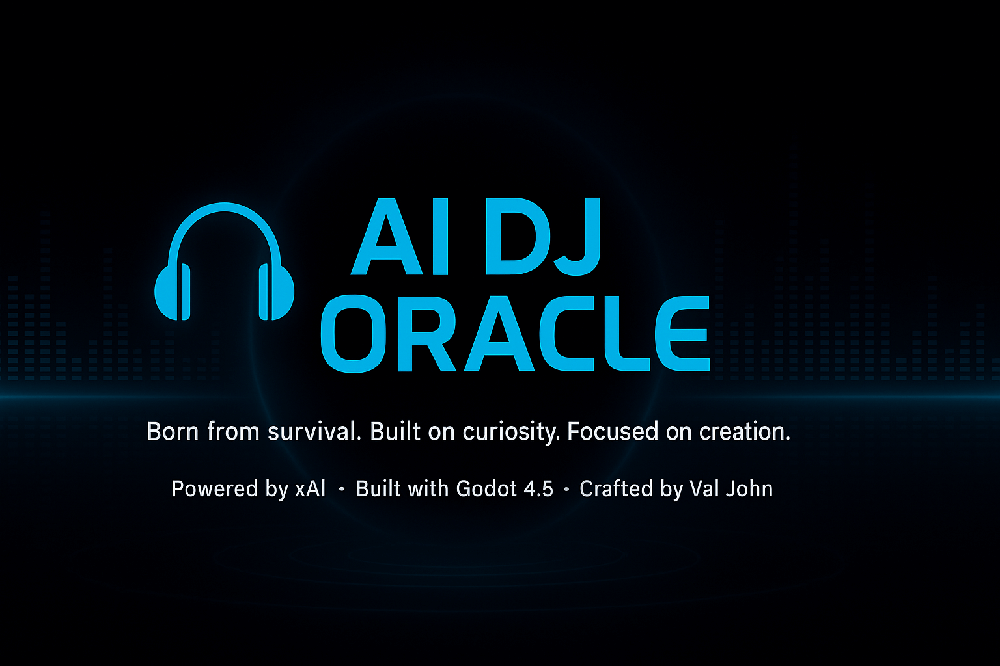

  <p align="center">
  
</p>


---

# 🎧 AI DJ Oracle  

> **Born from survival. Built on curiosity. Focused on creation.**  
> Powered by **xAI**, built with **Godot 4.5**, and crafted by **Val John**.

---

## 🧠 Overview  

**AI DJ Oracle** is a lightweight **AI-powered virtual DJ** built with **Godot** and **xAI (Grok)**.  
It simulates a conversational DJ that responds to messages, recommends songs, and sets the mood with dynamic dialogue and sleek visuals.  

The project connects a **Godot frontend** to a **Python Flask backend**, using **xAI’s API** for text responses.

---

## 🚀 Features  

🎵 **Conversational AI DJ** – Responds to user input in real time  
💬 **Chat Interface** – Built using Godot’s UI system with BBCode styling  
🌈 **Custom Theme** – Sleek neon blue + black design for a futuristic aesthetic  
🧩 **Python Integration** – Flask backend bridge for xAI API  
⚙️ **Easy to Extend** – Plug in your own model, modify UI, or add audio  

---

## 🧰 Tech Stack  

| Component | Technology |
|------------|-------------|
| **Frontend** | Godot 4.5 (GDScript) |
| **Backend** | Python Flask |
| **AI Model** | xAI Grok |
| **Language** | GDScript / Python |
| **Assets** | Custom theme & vector icon by Val John |

---

## 🧑‍💻 Local Setup  

1. **Clone the repository**
   ```bash
   git clone https://github.com/YourUsername/ai-dj-oracle.git
   cd ai-dj-oracle

Set up the Python bridge

pip install flask openai


Add your xAI API key
Create a .env file in ai-dj-oracle/ with:

XAI_API_KEY=your_api_key_here


Run the backend

python ai_bridge.py


Run Godot

Open project.godot in Godot 4.5+

Press ▶️ to start chatting with your AI DJ

🧪 Project Structure
ai-dj-oracle/
├── project.godot
├── ai_bridge.py
├── ui_root.gd
├── main.tscn
├── themes/
│   └── ai_chat_theme.tres
├── assets/
│   ├── github_banner.png
│   └── repo_icon.png
└── scenes/


This project started as a creative fusion of music, AI, and interactivity —
turning a simple chat interface into a digital DJ personality.

“Music is energy, and AI is emotion in logic form.” – Val John

🛠️ Future Ideas

🎚️ Integrate live music playback via Spotify API

🧠 Add emotion-based responses and personalization

🌐 Deploy web version via Godot Web Export

🎨 Include animated background EQ visualizer